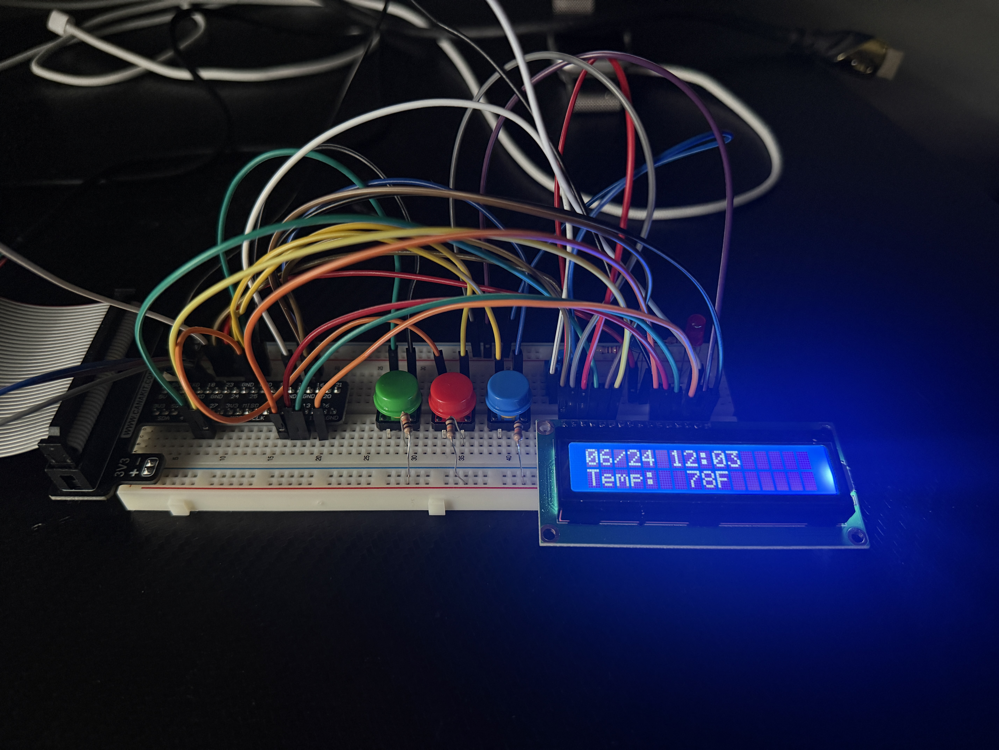
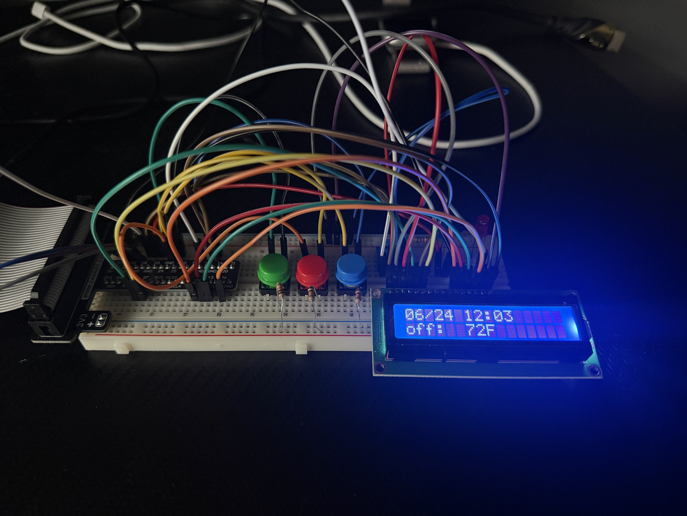
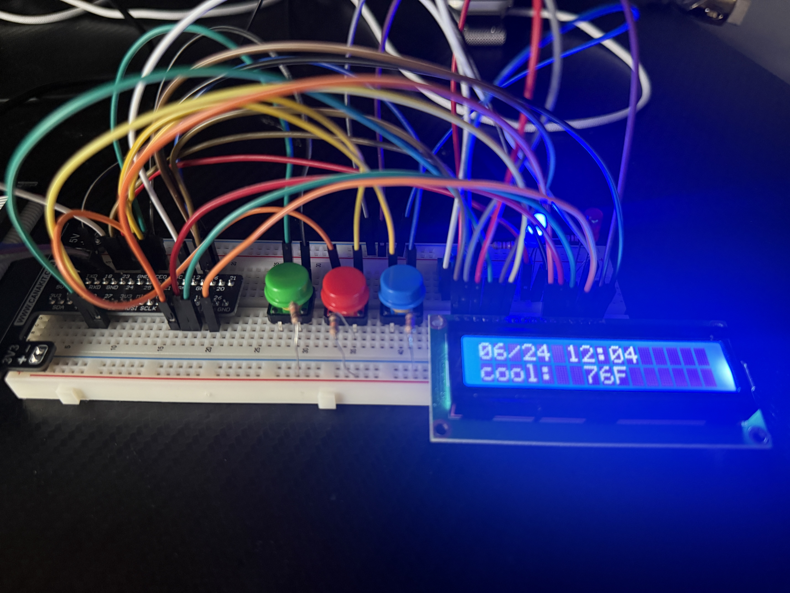
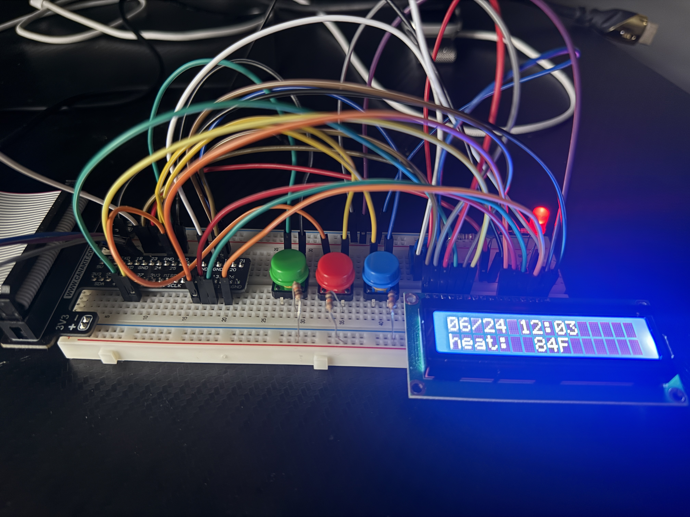

# Raspberry Pi Smart Thermostat Prototype

An embedded systems prototype of a thermostat developed on a Raspberry Pi. This project implements a finite state machine (FSM) to handle temperature monitoring, heating/cooling control loops, user input interrupts, and local data logging simulation.

Built as part of the CS 350 Emerging Systems Architecture & Technology course at Southern New Hampshire University.

## Overview

The system continuously reads ambient room temperature from an I2C sensor, processes user temperature set points via hardware interrupts, manages state transitions (Off, Heating, Cooling), outputs the system status to an LCD, and simulates server communication by streaming JSON-formatted telemetry over a UART serial port.

## 🛠️ Hardware Architecture & Peripherals

The prototype is built on the **Raspberry Pi 4B** architecture and utilizes the following hardware peripherals:

* **AHT20 Temperature & Humidity Sensor:** Connected via the **I2C** protocol to sample ambient room temperature.
* **State Control Button:** A physical push button configured via the `gpiozero` library to cycle the system between three primary operational states: `OFF`, `HEAT`, and `COOL`.
* **Temperature Adjustment Buttons:** Two physical buttons configured with hardware **GPIO interrupts** to dynamically increase or decrease the target temperature set point.
* **Status LEDs (GPIO Output):**
    * 🔴 **Red LED:** Fades in and out using Pulse-Width Modulation (PWM) when **Heat is Active**.
    * 🔵 **Blue LED:** Fades in and out using PWM when **Cooling is Active**.
    
    > *Note:* If the ambient temperature perfectly matches the set point, the respective LED switches to a solid, stable state.

* **LCD Display:** Outputs the current system date/time, ambient temperature, and the user's temperature set point.
* **UART Serial Port:** Simulates a Wi-Fi cloud connection by transmitting real-time state and environmental data packets to a host terminal.

## ⚙️ State Machine Functionality

The core execution logic is governed by a synchronous finite state machine. 

### State Transitions:
1.  **OFF State:** The system ignores temperature differentials. LEDs are unlit, and the thermostat is idle. Pressing the state button transitions the system to **HEATING**.
2.  **HEATING State:** Compares ambient temperature to the set point. If the room is colder than the set point, the Red LED fades to indicate active heating. Pressing the state button transitions the system to **COOLING**.
3.  **COOLING State:** Compares ambient temperature to the set point. If the room is warmer than the set point, the Blue LED fades to indicate active cooling. Pressing the state button loops the system back to **OFF**.

## Questions

* **What did you do particularly well?**

  For this project, I believe I organized myself particularly well and displayed a great showcase of problem-solving. When I came across issues where anything malfunctioned, I was quick to sit down, analyze what went wrong, and fix it, even if it meant starting over.
  
* **Where could you improve?**

  I could improve on my state machine diagrams. As a reminder to myself, I need to stop abstracting how the SM works, since any functionality is has should be properly documented.
  
* **What tools and/or resources are you adding to your support network?**

  Official documentation was my best friend during this whole course. Being able to read documentation as well as looking at what worked on previous assignments as a reference can help bring the pieces of the puzzle together.
  
* **What skills from this project will be particularly transferable to other projects and/or course work?**

  Everything that I did in this project, I plan on using in my future whenever I want to build anything in the embedded systems sector. Additionally, the understanding of how state machines work essentially brings a deeper understanding on how anything in Computer Science works. Although mostly abstracted nowadays, state machines are everywhere and now more complicated than ever.
  
* **How did you make this project maintainable, readable, and adaptable?**
  
  During my programming journey in this class, I made sure to document every single thing I did by using comments in the code. 

## Screenshots

### Thermostat Reading Current Room Temperature

### Thermostat Showing current Set Point

### Thermostat in Cooling Mode (Setpoint 76ºF)

### Thermostat in Heating Mode (Setpoint 84ºF)

## Contact

[LinkedIn](https://www.linkedin.com/in/abrahamdguerrero/)
[Email](mailto:abrahamgue02@gmail.com)
